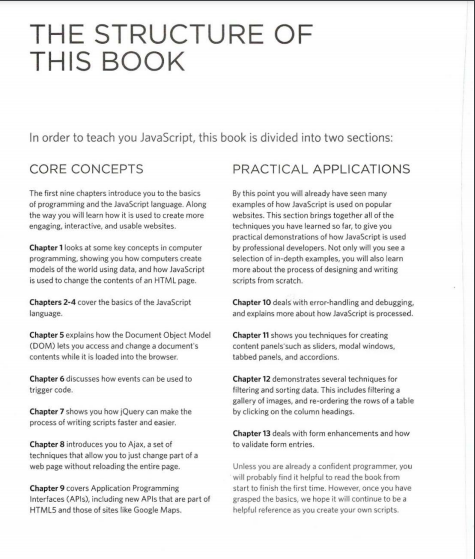

# Duckett HTML book summarizes 

 In this book thy give us the right way to learn html and css with alot of examples and those are some of ther examples to explain the material 
 

HTML  | Css | Practical|
------------ | ------------- | -------------
We will spend the first chapter looking at how HTML is used to create web pages. You will see that you start by writing down the words you want to appear on your page. You then add tags or elements to the words so that the browser knows what is a heading, where a paragraph begins and ends, and so on. The rest of this section introduces the tags you have at your disposal to create web pages, grouped into chapters on: text, lists, links, images, tables, forms, video audio and flash, andmiscellaneous elements.I should warn you that the examples in the first nine chapters are not exciting to look at, yet they are the foundation ofevery web page. The following chapters on CSS will show you how to make your pages look a lot more interesting. |  We start this section with a chapter that explains how CSS uses rules to enable you to control the styling and layout of web pages. We then go on to look at the wide variety of CSS properties you can use in your CSS rules. These properties generally fall into one of two categories: Presentation: How to control things like the color of text, the fonts you want to use and the size of those fonts, how to add background colors to pages (or parts of a page), and how to add background images. Layout: How to control where the different elements are positioned on the screen. You will also learn several techniques that professionals use to make their pages more attractive.| We end up with some helpful information that will assist you in building better websites. We look at some new tags that will be introduced in HTML5 to help describe the structure of your pages. HTML5 is the latest version of HTML (still under development at the time of writing). Before learning about these elements, you need a good grasp of how CSS is used to control the design of web pages. There is a chapter that talks you through a design process that you might like to follow when creating a new website. Finally, we end up looking at topics that will help you once you have built your site, such as putting it on the web, search engine optimisation (SEO) and using analytics software to track who comes to your site and what they are looking at.

# Duckett JS book summarizes
## EXAMPLES OF JAVASCRIPT IN THE BROWSER 

Being able to change the content of an HTML page while it is loaded in the browser is very powerful. The examples below rely on the ability to:
1- Access the content of the page
2- Modify the content of the page
3- Program rules or instructions the browser can follow
4- React to events triggered by the user or browser

