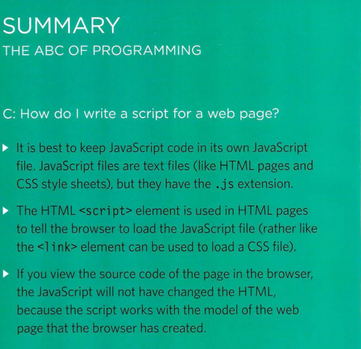
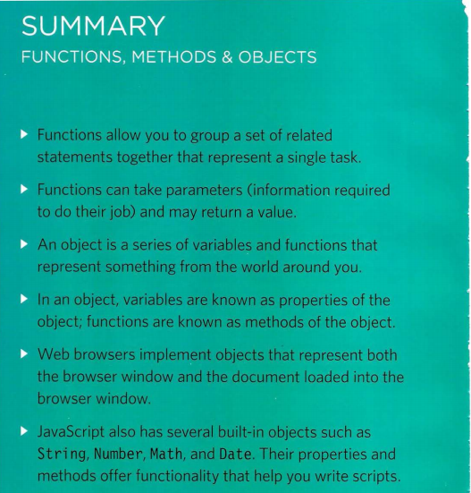

# From the Duckett HTML book:

## Chapter 2: “Text” (pp.40-61)

### Summary STRUCTURE

* HTML pages are text documents.
* HTML uses tags (characters that sit inside angled 
brackets) to give the information they surround special 
meaning.
* Tags are often referred to as elements.
* Tags usually come in pairs. The opening tag denotes 
the start of a piece of content; the closing tag denotes 
the end.
* Opening tags can carry attributes, which tell us more 
about the content of that element.
* Attributes require a name and a value.
* To learn HTML you need to know what tags are 
available for you to use, what they do, and where they 
can go.

### Summary TEXT
X HTML elements are used to describe the structure of 
the page (e.g. headings, subheadings, paragraphs).
X They also provide semantic information (e.g. where 
emphasis should be placed, the definition of any 
acronyms used, when given text is a quotation).

### Chapter 10: Ch.10 “Introducing CSS” (pp.226-245)

### Summary FLASH, VIDEO & AUDIO
* Flash allows you to add animations, video and audio to 
the web.
* Flash is not supported on iPhone or iPad.
* HTML5 introduces new <video> and <audio>
elements for adding video and audio to web pages, but 
these are only supported in the latest browsers.
* Browsers that support the HTML5 elements do not 
all support the same video and audio formats, so you 
need to supply your files in different formats to ensure 
that everyone can see/hear them. 
  
  
  
### Summary INTRODUCING CSS
* CSS treats each HTML element as if it appears inside its own box and uses rules to indicate how that element should look.
* Rules are made up of selectors (that specify the elements the rule applies to) and declarations (that indicate what these elements should look like).
* Different types of selectors allow you to target your rules at different elements.
* Declarations are made up of two parts: the properties of the element that you want to change, and the values of those properties. For example, the font-family 
property sets the choice of font, and the value arial specifies Arial as the preferred typeface.
* CSS rules usually appear in a separate document, although they may appear within an HTML page.
  
#  From the Duckett JS book:

  ## Chapter 2: “Basic JavaScript Instructions” (pp.53-84)

  
  

  
  
  
