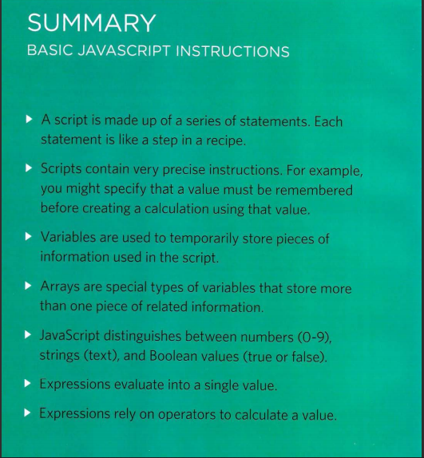
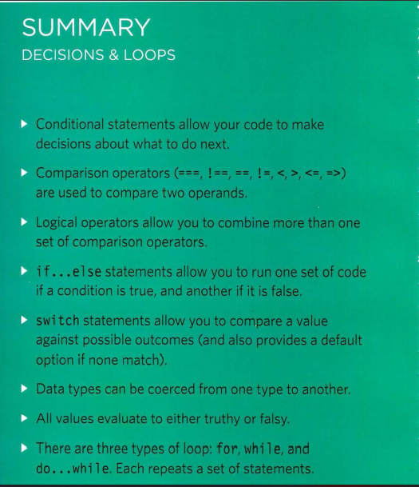

# From the Duckett HTML book:

## Summary TEXT

* HTML elements are used to describe the structure of 
the page (e.g. headings, subheadings, paragraphs).
* They also provide semantic information (e.g. where 
emphasis should be placed, the definition of any 
acronyms used, when given text is a quotation).

## Summary TEXT
* There are properties to control the choice of font, size, 
weight, style, and spacing.
* There is a limited choice of fonts that you can assume 
most people will have installed.
* If you want to use a wider range of typefaces there are 
several options, but you need to have the right license 
to use them.
* You can control the space between lines of text, 
individual letters, and words. Text can also be aligned 
to the left, right, center, or justified. It can also be 
indented.
* You can use pseudo-classes to change the style of an 
element when a user hovers over or clicks on text, or 
when they have visited a link

# From the Duckett JS book:

